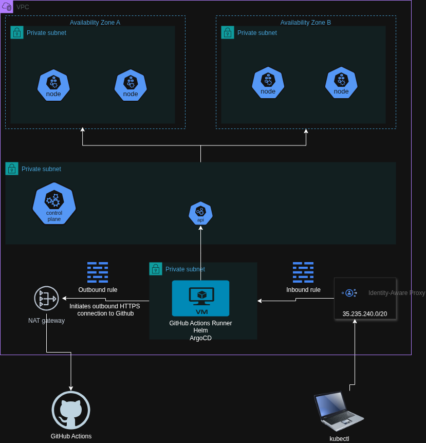

# GitHub Actions Runner on GCP Terraform Automation

## Overview
This Terraform project automates the creation of a **secure self-hosted GitHub Actions runner** on Google Cloud Platform (GCP). The runner is designed to be private, minimal, and ready to deploy to GKE clusters.

Key features:  
- Runner VM has **no public IP** and connects to GKE via private access.  
- **Minimal IAM** permissions for GKE deployments and GitHub secret access.  
- Firewall rules configured for **IAP tunnel** access.  
- **Cloud NAT** enabled for outbound internet access from private subnet.  
- VM installs **Google Cloud SDK**, **kubectl**, **Helm**, and the **GitHub Actions runner** automatically.  
- The runner can be used as a secure bastion for interactive access to the Kubernetes cluster.





## Prerequisites
Before using this Terraform project, ensure the following:  
1. A **GCP project** with billing enabled.  
2. An **existing VPC network and subnet** where the runner VM will reside.  
3. **Secret Manager API enabled** on your GCP project
4. **GitHub Personal Access Token (PAT)** stored in **Secret Manager**.  
5. **Terraform CLI** installed on your workstation.

### Generating a GitHub Fine-Grained Personal Access Token (PAT)

To register a self-hosted runner, you need a GitHub fine-grained PAT with specific repository access and permissions. Follow these steps:

1. Go to your GitHub account **Settings** → **Developer settings** → **Personal access tokens** → **Fine-grained tokens**.  

2. Click **Generate new token**.  

3. Under **Resource owner**, choose your GitHub user or organization that owns the repository.  

6. Under **expiration** set the Token expiration (recommended: 90 days or a manageable custom period). 

4. Under **Repository access**, select **Only select repositories**, then choose the repository you want the runner to register to, for example: `goland10/multi-cloud-k8s`  

5. Under **Permissions**, click **Add permissions** and set the following repository permissions (minimum required):  
   - **Administration → Read and write** ✅  
   - **Actions → Read and write**  
   - **Metadata → Read-only**  

7. Click **Generate token**.  

8. Copy the token immediately — you won’t be able to see it again.  

9. Store the PAT token securely in **GCP Secret Manager** using the following commands:

    ```bash
    echo -n "YOUR_GITHUB_PAT" | gcloud secrets create multi-cloud-k8s_github-runner \
      --data-file - \
      --project="YOUR_PROJECT_ID"
    ```

## How It Works

1. Terraform creates a service account for the runner with minimal IAM roles:

    - roles/container.developer for GKE access

    - roles/secretmanager.secretAccessor for fetching GitHub PAT

2. Terraform sets up a Cloud NAT router for internet access from the private subnet.

3. Firewall rules are created:

    - Inbound TCP 22 from IAP only

    - Outbound access to all destinations

4. Terraform deploys a VM instance:

    - Ubuntu 24.04 LTS

    - Installs gcloud, kubectl, Helm, and GitHub Actions runner

    - Downloads the latest GitHub runner release and registers it to the specified repository using the PAT from Secret Manager.

## Required Variables (runner.tfvars)

Users must provide the following variables in a .tfvars file:
| Variable     | Description                                    | Example                          |
| ------------ | ---------------------------------------------- | -------------------------------- |
| `project_id` | GCP project ID where resources will be created | `"github-actions-terraform-k8s"` |
| `region`     | GCP region for networking and NAT              | `"europe-west1"`                 |
| `zone`       | GCP zone for the runner VM                     | `"europe-west1-b"`               |
| `network`    | Existing VPC network name                      | `"dev-01"`                       |
| `subnet`     | Existing subnet name                           | `"dev-01-subnet"`                |
| `secret_name`| The secret that was stored in the secret manager| `"github_pat"`                  |

## Example: Running the Automation

1. Create a runner.tfvars file with your variables:
    ```h
    project_id = "github-actions-terraform-k8s"
    region     = "europe-west1"
    zone       = "europe-west1-b"
    network    = "dev-01"
    subnet     = "dev-01-subnet"
    secret_name = "github_pat"
    ```
2. Run terraform
    ```bash
    terraform init
    terraform validate
    terraform plan -var-file runner.tfvars -out=tfplan
    terraform apply -var-file="runner.tfvars" tfplan
    ```
Terraform will create the service account, networking resources, firewall rules, NAT, and the VM with the GitHub Actions runner configured. Once completed, the runner will automatically register with your GitHub repository.